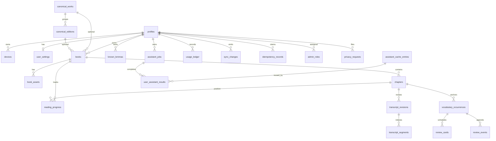

# Multi-user PostgreSQL schema

Phase 4.1 system of record plus Phase 4.2 row-level isolation. Tables and
policies come from versioned SQL in `server/supabase/migrations/`.

## Ownership

| Scope | Tables |
| --- | --- |
| Private, synchronized | `profiles`, `devices`, `user_settings`, `books`, `book_assets`, `chapters`, `reading_progress`, `transcript_revisions`, `transcript_segments`, `vocabulary_occurrences`, `known_lemmas`, `review_cards`, `review_events`, `user_assistant_results` |
| Private, server-owned | `assistant_jobs`, `usage_ledger`, `sync_changes`, `idempotency_records`, `admin_roles`, `privacy_requests` |
| Global / operational | `canonical_works`, `canonical_editions`, `assistant_cache_entries`, `feature_flags`, `model_policies`, `audit_events` |

Synchronized private rows carry `id`, `user_id`, `created_at`, `updated_at`,
`server_version`, `deleted_at`, and `last_mutation_id`. Authorization fields are
relational columns, not JSON. Child rows use composite tenant FKs such as
`(user_id, book_id) REFERENCES books (user_id, id)`. `assistant_cache_entries`
stores no `user_id` and no source passage. In-flight `assistant_jobs` keep their
`cache_key` claim if the first requester is deleted (`user_id` is `ON DELETE SET NULL`).

## Entity relationship

Operational tables with no user FK: `feature_flags`, `model_policies`, `audit_events`.

## Row Level Security

Every core table has `ENABLE ROW LEVEL SECURITY` and `FORCE ROW LEVEL SECURITY`.

Authenticated JWTs are scoped with `auth.uid()` and `public.current_user_is_active()`:

- Synchronized private tables and `privacy_requests`: select/insert/update/delete own rows
- `assistant_jobs`, `usage_ledger`, and `sync_changes`: select own rows only
- `assistant_cache_entries`, `model_policies`, `admin_roles`, `audit_events`,
  `idempotency_records`, `feature_flags`, `canonical_works`, and
  `canonical_editions`: no JWT policies (normal clients cannot query them)

Suspended profiles (`account_status` other than `active`, or `deleted_at` set)
cannot read or write rows. Users cannot insert `admin_roles` or write
`usage_ledger`; quota and role assignment are server-assigned.

`service_role` has `BYPASSRLS` and is for server-side Workers only. Clients never
receive this key. Privileged behavior is exposed through the API, not by handing
a service-role JWT to a browser or native app.
