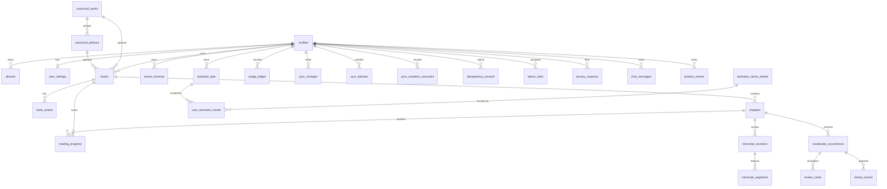

# Multi-user PostgreSQL schema

Phase 4.1 system of record, Phase 4.2 row-level isolation, and Phase 4.3/4.4
transaction functions. Tables, policies, and RPCs come from versioned SQL in
`server/supabase/migrations/`.

## Ownership

| Scope                 | Tables                                                                                                                                                                                                                                             |
| --------------------- | -------------------------------------------------------------------------------------------------------------------------------------------------------------------------------------------------------------------------------------------------- |
| Private, synchronized | `profiles`, `devices`, `user_settings`, `books`, `book_assets`, `chapters`, `reading_progress`, `transcript_revisions`, `transcript_segments`, `vocabulary_occurrences`, `known_lemmas`, `review_cards`, `review_events`, `user_assistant_results` |
| Private, user-filed   | `privacy_requests` (authenticated JWT may CRUD own rows)                                                                                                                                                                                           |
| Private, server-owned | `assistant_jobs`, `usage_ledger`, `sync_changes`, `sync_batches`, `sync_mutation_outcomes`, `idempotency_records`, `admin_roles`, `chat_messages`, `product_events`                                                                                  |
| Global / operational  | `canonical_works`, `canonical_editions`, `assistant_cache_entries`, `feature_flags`, `quota_limits`, `model_policies`, `audit_events`, `operator_settings`, `passwordless_hits`, `passwordless_cooldowns`, `passwordless_blocked_attempts`               |

Synchronized private rows carry `id`, `user_id`, `created_at`, `updated_at`,
`server_version`, `deleted_at`, and `last_mutation_id`. Authorization fields are
relational columns, not JSON. Child rows use composite tenant FKs such as
`(user_id, book_id) REFERENCES books (user_id, id)`. `assistant_cache_entries`
stores no `user_id` and no source passage. Sentence rows key on source text plus
languages/level/edition/policy; word rows also digest the containing sentence.
In-flight `assistant_jobs` keep their
`cache_key` claim if the first requester is deleted (`user_id` is `ON DELETE SET NULL`).

## Entity relationship

Operational tables with no user FK: `feature_flags`, `quota_limits`, `model_policies`,
`audit_events`, `operator_settings`, `passwordless_hits`, `passwordless_cooldowns`,
`passwordless_blocked_attempts`. `chat_messages` and `product_events` are Worker-owned
(`user_id` set, no JWT policies). `idempotency_records.user_id` is a UUID without a profiles FK so
anonymous OTP writes can share claims.

## Row Level Security

Every core table has `ENABLE ROW LEVEL SECURITY` and `FORCE ROW LEVEL SECURITY`.

Authenticated JWTs are scoped with `auth.uid()` and `public.current_user_is_active()`:

- Synchronized private tables and `privacy_requests`: select/insert/update/delete own rows
- `assistant_jobs`, `usage_ledger`, and `sync_changes`: select own rows only
- `assistant_cache_entries`, `model_policies`, `admin_roles`, `audit_events`,
  `operator_settings`, `idempotency_records`, `sync_batches`, `sync_mutation_outcomes`, `feature_flags`, `quota_limits`,
  `canonical_works`, `canonical_editions`, `chat_messages`, `passwordless_hits`,
  `passwordless_cooldowns`, `passwordless_blocked_attempts`, and `product_events`: no JWT policies
  (normal clients cannot query them)

Suspended profiles (`account_status` other than `active`, or `deleted_at` set)
cannot read or write rows. Users cannot insert `admin_roles` or write
`usage_ledger`; quota and role assignment are server-assigned.

`service_role` has `BYPASSRLS` and is for server-side Workers only. Clients never
receive this key. Privileged behavior is exposed through the API, not by handing
a service-role JWT to a browser or native app.

## Transaction functions

Server-only `SECURITY DEFINER` RPCs. EXECUTE is granted to `service_role` only.

- `claim_idempotency_record` / `record_idempotency_response` / `abort_idempotency_record`:
  claim, store, and replay idempotent HTTP responses
- `append_sync_change`: lock the profile, bump `server_version`, append the next
  per-user sequence
- `push_sync_batch`: bind a batch ID to its mutation fingerprint, reject duplicate
  IDs before writes, preserve terminal mutation outcomes, and apply one ordered
  sync batch under the profile lock
- `claim_assistant_generation`: insert one in-flight job per `cache_key`, or
  attach when the unique index rejects a second owner
- `attach_user_assistant_result`: point another user's private result at an
  existing job
- `complete_assistant_job` / `fail_assistant_job`: finish a job atomically
  (cache write + linked results, or failed/dead-letter)
- `append_audit_event`: append an audit row with actor `user`/`admin`/`system`,
  action, resource type/ID, reason, request ID, source IP hash, and redacted
  before/after metadata

`audit_events` are immutable: a before-row trigger stamps `created_at`, redacts
sensitive metadata, and rejects update/delete. The partial unique index
`assistant_jobs_inflight_cache_key_uidx` is the final single-flight guarantee.
